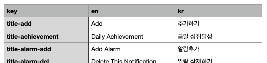

# localizable-prop-gen
The generator for Swift code line of localizable.string and its properties.

## Use to:
1. Open python console  
2. Command:
> import gen  
> gen.props()  
> gen.loc_strings('en')  
> gen.loc.string('kr')

## File format:
1. CSV file only
